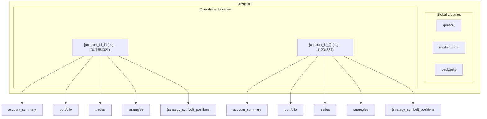

# ArcticDB Architecture

This document outlines the finalized data storage architecture for the multi-strategy trading system using ArcticDB. The design separates global, static data from operational, account-specific data for clarity, scalability, and performance.

## Core Principles

1.  **Separation of Concerns**: Global configuration and market data are stored separately from live operational data like PnL and positions.
2.  **Account-Centric Organization**: All data related to a single trading account (live or paper) is consolidated within a single, dedicated library.
3.  **Performance**: Data structures are chosen to align with ArcticDB's strengths, favoring columnar, versioned timeseries data over nested structures like JSON strings.

---

## Architectural Overview

The architecture is divided into two main categories of libraries:

1.  **Global Libraries**: Account-independent data.
2.  **Operational Libraries**: Account-specific data, with one library per trading account.

---

## 1. Global Libraries

These libraries store data that is shared across the entire system and is not tied to a specific account's operations.

### `general`
-   **Purpose**: Stores system-wide metadata and configuration.
-   **Symbols**:
    -   `strategies`: A master table defining all available strategies. This is the single source of truth for strategy configuration.
        -   **Index**: `strategy_symbol` (e.g., "TQQQ", "GOOGL").
        -   **Columns**: `filename`, `target_weight` (default allocation), `params` (default parameters as a JSON string).

### `market_data`
-   **Purpose**: Stores all historical and live market data.
-   **Symbols**: A unique symbol for each instrument and timeframe (e.g., `AAPL_1_day`, `TQQQ_1_min`, `SPY_5_secs`).
-   **Data**: Standard OHLCV dataframes indexed by `timestamp`.

### `backtests`
-   **Purpose**: Stores the high-level results and artifacts of completed backtest runs.
-   **Symbols**: A unique symbol for each backtest run, perhaps using a UUID (e.g., `run_20250915_tqqq_sma_crossover`).
-   **Data**: Can store equity curves, trade logs, and final performance metrics for the entire backtest portfolio.

---

## 2. Operational Libraries (`{account_id}`)

This is the core of the operational data storage. A new library is created for each trading account (live or paper), using the account ID as the library name.

-   **Library Name Example**: `DU7654321` (for a paper account), `U1234567` (for a live account).

Inside each account library, the following symbols are used:

### `account_summary`
-   **Purpose**: Stores a daily timeseries of high-level metrics for the entire account.
-   **Data**: DataFrame indexed by `timestamp`.
-   **Columns**: `equity`, `pnl`, `cash`, `market_value`.

### `portfolio`
-   **Purpose**: Stores historical snapshots of the entire account's positions.
-   **Data**: DataFrame with a **multi-index** of `(timestamp, symbol)`.
-   **Columns**: `position`, `average_cost`, `market_price`, `market_value`.

### `trades`
-   **Purpose**: A comprehensive log of all trades executed within the account.
-   **Data**: DataFrame indexed by a unique `execution_id`.
-   **Columns**: `timestamp`, `strategy_symbol` (to attribute the trade), `symbol`, `action`, `quantity`, `price`.

### `orders`
-   **Purpose**: A log of all order creation and status change events.
-   **Data**: DataFrame indexed by `order_id`.
-   **Columns**: `timestamp`, `strategy_symbol`, `symbol`, `action`, `quantity`, `order_type`, `status`.

### `fills`
-   **Purpose**: A log of all order fill events.
-   **Data**: DataFrame indexed by `fill_id`.
-   **Columns**: `timestamp`, `order_id`, `strategy_symbol`, `symbol`, `action`, `quantity`, `price`.

### Strategy-Specific Symbols

To ensure data isolation and avoid potential issues with multi-index updates, each strategy will have its own set of symbols within the account library, prefixed with the strategy's name.

#### `strategy_{symbol}_equity`
-   **Purpose**: Stores the timeseries of the equity explicitly allocated to a single strategy. This is the value read by the broker's `_get_strategy_equity_from_arctic()` method.
-   **Symbol Name Example**: `strategy_TQQQ_equity`, `strategy_GOOGL_equity`.
-   **Data**: A simple DataFrame indexed by `timestamp` with a single `equity` column.

#### `strategy_{symbol}_positions`
-   **Purpose**: Stores the historical portfolio snapshots for a single strategy.
-   **Symbol Name Example**: `strategy_TQQQ_positions`, `strategy_GOOGL_positions`.
-   **Data**: DataFrame indexed by `timestamp`, with columns for each symbol held by the strategy representing the position size.
