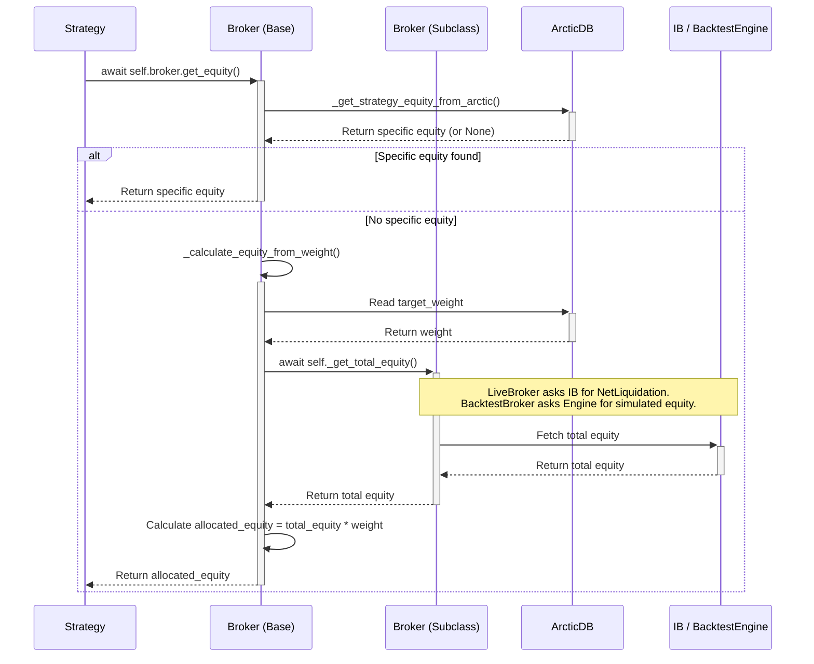

# Broker Abstraction Layer Architecture

This document outlines the architecture of the broker abstraction layer, designed to provide a unified interface for trading strategies, whether they are running in a live environment or a backtesting simulation.

## Core Objective

The primary goal is to allow a trading strategy's logic to be written once and function identically in both live trading and backtesting. A strategy should not need to know if it's interacting with a real broker (like Interactive Brokers) or a simulated one. It simply places orders through a consistent interface.

This is achieved through **Polymorphism** and **Abstract Base Classes**.

## Key Components

The broker system is composed of three main classes:

1.  `Broker` (Abstract Base Class in `backend/broker/base_broker.py`)
2.  `LiveBroker` (Concrete implementation in `backend/broker/live_broker.py`)
3.  `BacktestBroker` (Concrete implementation in `backend/broker/backtest_broker.py`)

Additionally, the `BaseStrategy` class in `backend/strategies/base_strategy.py` is responsible for initializing and using a broker instance.

---

## 1. The `Broker` Abstract Base Class

The `Broker` class defines the **contract** or **interface** that all broker implementations must follow. It contains the common logic shared by all brokers and defines abstract methods for the logic that is specific to each implementation.

### Key Attributes

-   `strategy_symbol` (str): The symbol of the strategy using this broker (e.g., "TQQQ").
-   `arctic_client`: An instance of an ArcticDB client used for reading equity allocations and weights.

### Core Methods

#### `async def get_equity(self) -> float`
This is the primary method strategies call to determine their allocated capital. It implements a unified, two-tier logic:

1.  **Check for Specific Allocation**: It first calls `_get_strategy_equity_from_arctic()`. This method looks for an explicit equity value assigned to the strategy in the `strategy_equity` library in ArcticDB. If found, this value is used directly.

2.  **Fallback to Weight-Based Allocation**: If no specific equity is found, it calls `_calculate_equity_from_weight()`. This method reads the `target_weight` for the strategy from the `general/strategies` table and multiplies it by the **total portfolio equity**.

To get the total portfolio equity, it calls the abstract method `_get_total_equity()`.

#### `async def _get_total_equity(self) -> float` (Abstract Method)
This method is the key to the abstraction. The `Broker` base class knows it needs to get the total portfolio equity, but it delegates the *how* to its subclasses. This method **must** be implemented by `LiveBroker` and `BacktestBroker`.

#### `async def place_order(...) -> Trade` (Abstract Method)
This defines the interface for placing an order. The strategy provides the contract, order details, and a `size` parameter (a float from 0.0 to 1.0 representing a percentage of its allocated equity). The broker implementation is responsible for calculating the final order quantity and executing the trade.

#### `async def get_positions() -> List[Position]` (Abstract Method)
This defines the interface for retrieving the current list of open positions.

---

## 2. Concrete Implementations: `LiveBroker` and `BacktestBroker`

These classes inherit from `Broker` and provide the specific logic for their respective environments.

### `LiveBroker`

-   **`__init__(...)`**: Initializes with a live `ib_client` from `ib_async`.
-   **`_get_total_equity()`**: Implements the abstract method by connecting to the live Interactive Brokers account and fetching the `NetLiquidation` value from the account summary.
-   **`place_order()`**: Calculates the order quantity based on the strategy's allocated equity and the current market price, then places a real order through the `ib_client`.

### `BacktestBroker`

-   **`__init__(...)`**: Initializes with a `BacktestEngine` instance.
-   **`_get_total_equity()`**: Implements the abstract method by calling `self.engine.equity()` to get the current simulated portfolio equity from the backtest engine.
-   **`place_order()`**: Calculates the simulated order quantity and submits it to the `BacktestEngine` for processing against historical data.

---

## 3. How It All Works Together: The Call Flow

Here's the sequence of events when a strategy, running either live or in a backtest, wants to get its equity:

## 4. Integration with `BaseStrategy`

The `BaseStrategy` class handles the creation of the correct broker instance.

-   Its `__init__` method accepts a `broker_type` ('live' or 'backtest') and an optional `backtest_engine`.
-   After establishing a connection to IB (if required), the `_main_strategy_loop` calls `_initialize_broker()`.
-   `_initialize_broker()` checks the `broker_type` and instantiates either a `LiveBroker` or a `BacktestBroker`, passing the required dependencies (`ib_client` or `backtest_engine`).
-   This instance is stored in `self.broker`, ready for the strategy logic to use.

This setup ensures that the strategy code remains clean and agnostic of the execution environment, fulfilling the core objective of the abstraction layer.
