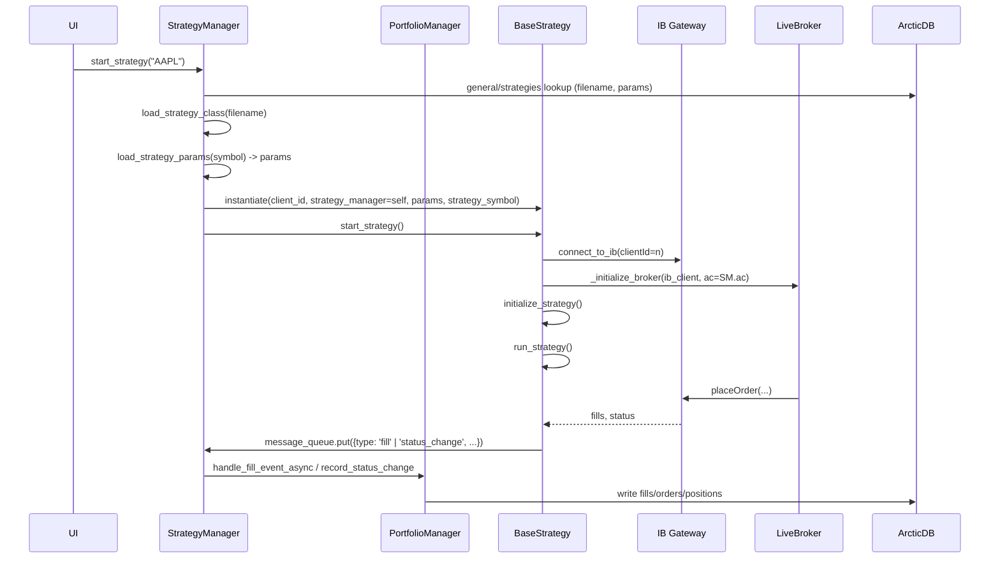

# Live Strategies: Architecture and Lifecycle

This document explains how live strategies are initialized, how parameters are loaded and persisted, how the ArcticDB client flows through the system, and how order/fill events are processed. It is based on the current code in:

- `core/strategy_manager.py`
- `obj/base_strategy.py`
- `broker/base_broker.py`
- `broker/live_broker.py`
- `core/portfolio_manager.py`
- `core/arctic_manager.py`

---

## Overview of the Main Components

- **`core/strategy_manager.py` (`StrategyManager`)**
  - Owns the master IB connection (`clientId=0`) and a single ArcticDB client (`ac`).
  - Loads per-strategy parameters from ArcticDB (or falls back to the strategy module’s `PARAMS`).
  - Dynamically loads a strategy module/class, instantiates it, injects itself, and starts it in its own thread/event loop.
  - Provides a `message_queue` that strategies can use to push standardized events (`order`, `fill`, `status_change`). A background thread consumes this queue and pushes data into the `PortfolioManager` and your UI/WebSocket layer.

- **`obj/base_strategy.py` (`BaseStrategy`)**
  - Abstract base for all strategies with general, reusable logic:
    - Strategy lifecycle (start/stop, thread/event-loop handling, cleanup).
    - IB connection for the strategy with a unique `client_id`.
    - Broker initialization (live → `LiveBroker`).
    - Standard event helpers `on_fill()` and `on_status_change()` that forward events to the `StrategyManager.message_queue`.
    - Loads (exposes) strategy weights from ArcticDB (`min_weight`, `target_weight`, `max_weight`) for allocation/sizing helpers.
    - **FX-aware equity and sizing**: Uses PortfolioManager's shared FX cache and base currency for proper cross-currency position sizing.
  - Provides a module-level `PARAMS` dict that all strategies can import and extend so strategy files remain minimal.

- **`broker/base_broker.py` (`Broker`)**
  - Defines the cross-broker interface and the equity allocation logic.
  - `get_equity()` uses a two-tier approach:
    1. Strategy-specific equity from ArcticDB if available (preferred).
    2. Fallback: `target_weight` × total account equity (from IB).

- **`broker/live_broker.py` (`LiveBroker`)**
  - Implements live order routing via `ib_async`.
  - Does not own persistence in the live path; fills/status are forwarded by `BaseStrategy` → `StrategyManager.message_queue` → `PortfolioManager`, which is the single writer to ArcticDB.
  - Receives the shared Arctic client (`ac`) only for read needs or optional utilities; persistence and account-library maintenance are centralized in `PortfolioManager`.

- **`core/portfolio_manager.py` (`PortfolioManager`)**
  - Consumes standardized events from `StrategyManager` and persists them to ArcticDB.
  - Records fills and order statuses in libraries like `fills/<STRATEGY>` and `orders/<STRATEGY>`.
  - Maintains per-strategy positions in `positions/<STRATEGY>` and can provide consolidated views.
  - **Owns the single FXCache instance** and determines the **account base currency** from IB account summary.
  - All strategies reference the shared FX cache and base currency for consistent currency conversions.

- **`core/arctic_manager.py`**
  - Provides `get_ac()` to open/create ArcticDB (local or S3 if configured via `general/settings`).
  - Ensures base libraries exist and uses `LibraryOptions(dynamic_schema=True)` so data schemas can evolve.

---

## Live Strategy Lifecycle (Step-by-Step)

1) **StrategyManager starts up**
   - In `StrategyManager.__init__`:
     - Creates or reuses the ArcticDB client: `self.ac = get_ac()`.
     - Creates the `PortfolioManager(self)` so PM can read `self.ac` and `self.ib_client`.
     - Connects to IB master session (`clientId=0`) via `utils/ib_connection.connect_to_ib()` and stores `self.ib_client`.
     - **PortfolioManager determines base currency** from IB account summary and **initializes the shared FXCache**.
     - Starts a background thread to process `self.message_queue`.

2) **Starting an individual strategy**
   - Call `StrategyManager.start_strategy(strategy_symbol)`.
   - `StrategyManager._get_strategy_filename()` reads the metadata in `general/strategies` to resolve the strategy file for `strategy_symbol` (from the `filename` column).
   - `StrategyManager.load_strategy_class(filename)` dynamically imports the module and selects the first class name ending with `Strategy` (excluding `BaseStrategy`).
   - `StrategyManager.load_strategy_params(strategy_symbol, module)` then loads parameters:
     - If `general/strategies.params` has a non-empty JSON string for this symbol, it is used (source of truth).
     - Else, if the module defines a `PARAMS` dict, it is used and persisted back to `general/strategies.params`.
   - Strategy instance is constructed with a unique `client_id`, injected `strategy_manager=self`, and the resolved params. The instance receives `strategy_symbol` and exposes it as `self.symbol`.
   - `strategy_instance.start_strategy()` begins the dedicated thread/loop.

3) **Inside `BaseStrategy._main_strategy_loop()`**
   - Ensures this strategy has its own IB connection using `connect_to_ib(client_id=<unique>)`.
   - Initializes the broker (live): `LiveBroker(ib_client=self.ib, strategy_symbol=self.symbol)`.
   - **Strategy references shared FX cache and base currency** from PortfolioManager for proper equity calculations and position sizing.
   - Calls your strategy’s `initialize_strategy()` (subscribe to realtime bars, qualify contracts, etc.).
   - Calls `run_strategy()` where your core logic lives.

4) **Event flow from IB to PortfolioManager**
   - Orders are placed through `LiveBroker`.
   - As IB emits order status and fills, your strategy can forward them through `BaseStrategy.on_status_change()` and `BaseStrategy.on_fill()` to `StrategyManager.message_queue`.
   - `StrategyManager` consumes the queue and calls `PortfolioManager` methods:
     - `process_fill(...)` to record fills, update positions.
     - `record_status_change(...)` to persist order status transitions.

5) **Stopping and cleanup**
   - `StrategyManager.stop_strategy(symbol)` calls the strategy’s `stop_strategy()`.
   - `BaseStrategy._cleanup()` will disconnect the strategy’s IB session and finalize.

---

## Where Parameters Come From and When They’re Loaded

- **Source of Truth**: `general/strategies` in ArcticDB.
  - Holds `filename`, `target_weight` and `params` (JSON), among others.

- **Load Order** (in `StrategyManager.load_strategy_params()`):
  1. If `general/strategies.params` for `strategy_symbol` is a non-empty JSON string, parse and return it.
  2. Otherwise, use the strategy module’s `PARAMS` dict and persist it back to `general/strategies.params` as a JSON string.

- **At Strategy Construction**:
  - The resolved `params` dict is passed into `BaseStrategy.__init__` as `params`.
  - `BaseStrategy` also reads `min_weight`, `target_weight`, `max_weight` from `general/strategies` and exposes them as attributes (`self.min_weight`, `self.target_weight`, `self.max_weight`).

This design centralizes parameter loading in the `StrategyManager` while keeping `BaseStrategy` resilient if ever instantiated without passed params.

---

## Shared Resources Flow

### ArcticDB Client (`ac`)
- `StrategyManager` creates and owns the ArcticDB client (`self.ac = get_ac()`).
- `PortfolioManager` receives `self.ac` via the `StrategyManager` reference.
- `BaseStrategy._initialize_broker()` passes `strategy_manager.ac` into `LiveBroker` so all components share a single Arctic client instance.

### FX Cache and Base Currency
- `PortfolioManager` determines the **account base currency** from IB AccountSummary (EquityWithLoanValue entries).
- `PortfolioManager` owns the **single FXCache instance** initialized with the account's base currency.
- All strategies access the shared FX cache via `self.strategy_manager.portfolio_manager.fx_cache`.
- This ensures consistent currency conversions across all strategies and eliminates duplicate FX rate lookups.

---

## Shared Base Parameters (`obj/base_strategy.py`)

`obj/base_strategy.py` defines a module-level `PARAMS` dict that all strategies can import and extend:

```python
from obj.base_strategy import BaseStrategy, PARAMS as BASE_PARAMS
PARAMS = {**BASE_PARAMS, **{ "universe": "AAPL", "target_weight": 0.10 }}
```

The current base fields include:

- Identification/Universe
  - `universe`: single symbol, comma-separated list of symbols, or an ArcticDB library identifier (e.g., "us_stocks").

- Allocation and rebalancing
  - `min_weight`: lower bound of allocation
  - `max_weight`: upper bound of allocation
  - `target_weight`: target allocation; used for rebalancing

- Position sizing and risk caps
  - `max_position_size`: fraction of strategy equity for a single position
  - `risk_per_trade`: fraction of strategy equity to risk per trade (for stop-based sizing)
  - `max_daily_loss`: fraction of equity loss to pause trading for the day
  - `max_daily_trades`: guardrail to limit churn

- Exits / risk management
  - `stop_loss`: initial stop loss fraction
  - `trailing_stop_loss`: trailing stop fraction used once a position is profitable
  - `take_profit`: fraction at which positions are closed to realize gains

These are intended to be generic enough for live strategies while giving you flexibility to override per-strategy.

---

## Minimal Live Strategy Template (Example)

```python
# my_strategy.py
from obj.base_strategy import BaseStrategy, PARAMS as BASE_PARAMS
from ib_async import Stock, MarketOrder

PARAMS = {
    **BASE_PARAMS,
    "universe": "AAPL",
    "target_weight": 0.10,
    "min_weight": 0.05,
    "max_weight": 0.15,
    "stop_loss": 0.03,
    "take_profit": 0.20,
}


#### CHANGE THIS EXAMPLE - WE DONT WANT TO use broker.place_order(), only wrappers from base_strategy

class MyStrategy(BaseStrategy):
    async def initialize_strategy(self):
        symbol = (self.params.get("universe", "AAPL").split(",")[0] or "AAPL").strip()
        self.contract = Stock(symbol, "SMART", "USD")
        if self.broker_type == "live" and self.ib and self.is_connected:
            try:
                await self.ib.qualifyContractsAsync(self.contract)
            except Exception:
                pass

    async def run_strategy(self):
        # One-time market buy using 100% of allocated equity (demo)
        order = MarketOrder("BUY", 0)
        await self.broker.place_order(self.contract, order, size=1.0)
        # Idle loop; rely on event-driven updates
        while self.is_running:
            await asyncio.sleep(1)
```

---

## Event and Data Flow (Mermaid)



---

## Practical Notes and Conventions

- **Centralized Param Loading**: Parameters are loaded by `StrategyManager` from `general/strategies` if present; otherwise module `PARAMS` are persisted back into ArcticDB. `BaseStrategy` only reads ArcticDB params as a fallback.

- **ArcticDB Client Reuse**: A single `ac` from `StrategyManager` is used throughout the app, including brokers and portfolio manager.

- **Equity Allocation**: When no strategy-specific equity is set, brokers use `target_weight × total_equity` as a fallback for sizing.

- **Message Queue**: Keep `on_fill()` and `on_status_change()` in your strategy to forward standardized events to `StrategyManager` and, ultimately, `PortfolioManager`.

- **Universe Handling**: The shared `PARAMS` includes `universe`, which can be a single symbol, a comma-separated list, or an identifier for an ArcticDB library. Strategies may implement their own interpretation.

---

## Suggested Extensions

- Add a helper to `BaseStrategy` for "max available" historical warmup aligned with IB rate limits (to support your preference for full lookback warmups).
- Expand the `PortfolioManager` consolidated views and add metrics.
- Add a strategy-level setting for trading windows and automated rebalancing respecting `min_weight`/`max_weight` and `target_weight`.
